# llms-explained



> A deep technical guide to how Large Language Models actually work, served as a single self-contained HTML file. Interactive, dual-themed, no build step.

---

## what it is

One HTML file. Seventeen chapters. From the math of self-attention to the economics of inference. Designed to read like a terminal session: monospace throughout, lowercase headers, `##` markdown-style markers, `$` shell prompts, blinking cursors, and a status bar that tracks your position as you scroll.

Toggle between a pure-white GitHub-style light mode and a true terminal-black dark mode with green-phosphor accents.

## features

| | |
|---|---|
| **17 chapters** | from token embeddings to inference economics |
| **interactive tokenizer** | type any text, watch it break into BPE chips in real time |
| **attention visualizer** | click a token, see which earlier tokens it attends to |
| **KV cache animation** | watch the cache fill up as the model decodes one token at a time |
| **sampling playground** | live temperature, top-p, and top-k sliders reshaping a probability distribution |
| **CPU vs GPU race** | 8 cores vs 64 cores on a 64×64 matrix multiply |
| **memory calculator** | pick model size, quantization, context length — see VRAM required |
| **two live charts** | output token pricing over time, parameter counts across model generations |
| **theme toggle** | white (GitHub-style) ↔ black (terminal) with localStorage persistence |
| **status bar** | live clock, scroll percentage, and current section path |

## demo

Open `index.html` directly in any modern browser. No installation, no dependencies.

```bash
git clone https://github.com/YOUR_USERNAME/llms-explained.git
cd llms-explained
open index.html       # macOS
xdg-open index.html   # Linux
start index.html      # Windows
```

Or enable **GitHub Pages** in the repo settings and serve it as a live site.

## stack

- Vanilla **HTML + CSS + JavaScript** — no framework, no bundler
- [Chart.js 4.4](https://www.chartjs.org/) loaded from CDN for the economic charts
- [IBM Plex Mono](https://fonts.google.com/specimen/IBM+Plex+Mono) + [JetBrains Mono](https://fonts.google.com/specimen/JetBrains+Mono) from Google Fonts
- ~268 KB single file

## topics covered

```
## 00_tldr           three insights that organize everything
## 01_foundations    neural networks, scaling laws, parameters
## 02_tokens         byte-pair encoding · vocab · embeddings
## 03_transformer    the decoder-only architecture
## 04_attention      Q, K, V math · softmax(QK^T / sqrt(d)) · V
## 05_positions      sinusoidal vs RoPE
## 06_inference      prefill vs decode · KV cache
## 07_sampling       temperature · top-p · top-k · nucleus
## 08_variants       MoE · GQA · FlashAttention · Mamba
## 09_training       pre-training · SFT · RLHF · Constitutional AI
## 10_hardware       why GPUs not CPUs · H100, H200, B200, MI300X
## 11_memory         VRAM math · quantization · FP16/FP8/INT4
## 12_parallelism    data · tensor · pipeline · expert
## 13_recent         long context · reasoning models · distillation
## 14_economics      the great deflation · pricing curves
## 15_end_to_end     a single query, keystroke to response
## 16_caveats        what we actually know and what we don't
```

## sources

**Primary research**
- Vaswani et al., 2017. *Attention Is All You Need.*
- Dao et al., 2022. *FlashAttention.*
- Gu & Dao, 2023. *Mamba.*
- Meta, 2024. *The Llama 3 Herd of Models.*
- Google DeepMind, 2024. *Gemini 1.5 Technical Report.*

**Industry data**
- NVIDIA, AMD, Google chip datasheets
- Epoch AI energy and compute analyses
- SemiAnalysis cost reporting

## license

MIT.

---

`v3.2` · `may 2026`
